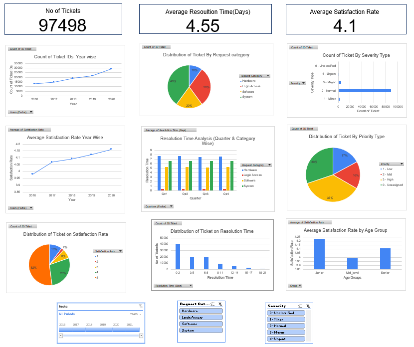
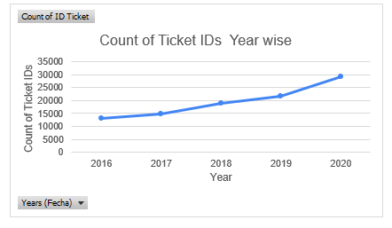
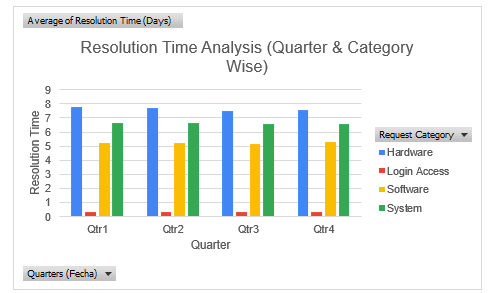
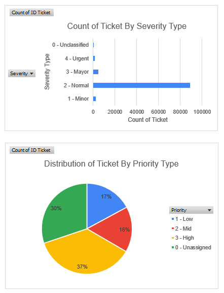

# IT Support Performance Dashboard (2016–2020)

## Project Overview
This project analyzes IT support ticket operations using Excel dashboards, pivot tables, and visual analytics.

The dashboard helps monitor:
- Ticket volume trends
- Resolution time
- Customer satisfaction
- Request categories
- Priority and severity analysis
- Agent performance

---

## Objectives
- Identify ticket trends over time
- Analyze customer satisfaction
- Monitor resolution efficiency
- Detect operational bottlenecks
- Support investment decisions using data

---

## Tools Used
- Microsoft Excel
- Pivot Tables
- Pivot Charts
- Slicers
- Dashboard Design
- Data Visualization

---

## Key KPIs

| KPI | Value |
|-----|------|
| Total Tickets | 97,498 |
| Avg Resolution Time | 4.55 Days |
| Avg Satisfaction Rate | 4.1 / 5 |

---

## Dashboard Features
- Interactive slicers
- Yearly and quarterly trend analysis
- Category-wise ticket distribution
- Severity and priority analysis
- Satisfaction analysis
- Resolution time analysis

---

## Key Insights
- Ticket volume increased steadily from 2016–2020
- Customer satisfaction remained stable despite workload growth
- Hardware and System requests had the longest resolution times
- High-priority tickets represented a significant workload
- Q4 showed peak ticket activity

---

## Recommendations
- Increase staffing during peak periods
- Invest in automation for repetitive requests
- Improve ticket prioritization system
- Upgrade infrastructure for hardware/system issues
- Use predictive analytics for workload forecasting

---

# Dashboard Preview

## Main Dashboard

---

## KPI Summary

---

## Ticket Volume Trend

---

## Resolution Analysis

---

## Priority & Severity Analysis

---

## Files Included
- Excel Dashboard
- Project Documentation
- Presentation Slides

---

## Author
Suman Shakthivel T.V.
